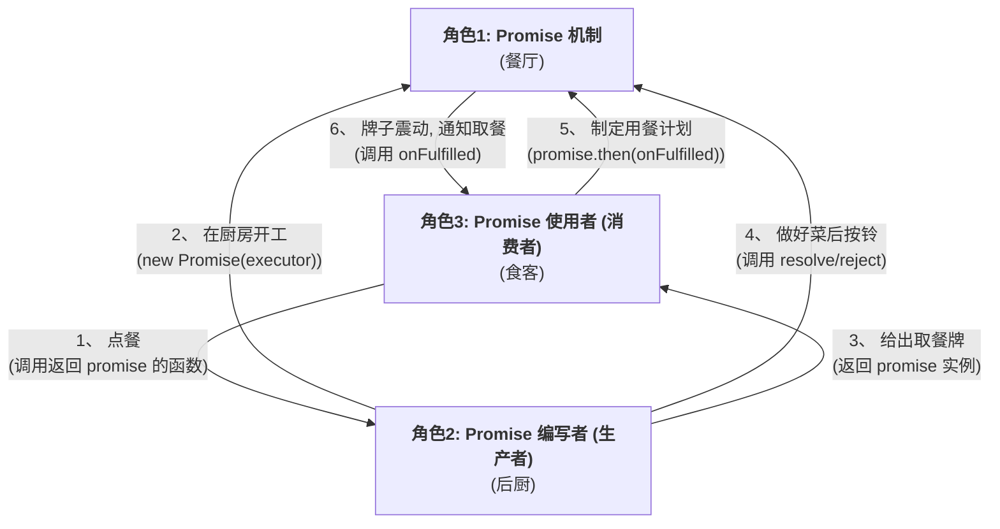

-----

### **学习笔记：Promise 的三大角色——深入理解 Promise 的协作模式**

#### **引言：Promise 不仅仅是一个工具，更是一种模式**

在 JavaScript 异步编程中，Promise 是一个无处不在的核心工具。然而，要真正精通它，我们需要超越其作为“一个可以 `.then()` 的对象”的表面认知，而是从一个更高的维度，将其理解为一种**管理异步协作的设计模式**。

这个模式的核心，就是将整个异步流程清晰地划分为三个独立的角色。理解这三个角色的职责与边界，是编写出清晰、健壮、可维护的异步代码的关键。

我们可以用一个“**高级餐厅**”的运作模式来比喻这三者的关系。

-----

### **角色一：Promise 机制 (The Mechanism) —— 餐厅**

  * **身份定义**：Promise 机制指的是 `Promise` 这个类本身的实现。它可以是浏览器或 Node.js 引擎内置的底层代码，也可以是我们手写的 `MyPromise` 类。
  * **核心职责**：
    1.  **提供契约**：它定义了整个 Promise 世界的规则和接口，比如 `new Promise(executor)` 的构造方式，以及 `.then()`, `.catch()`, `.finally()` 这些方法的行为。
    2.  **管理状态机**：它是 Promise 内部状态（`pending`, `fulfilled`, `rejected`）的忠实守护者，确保状态流转的正确性（例如，只能从 `pending` 改变一次）。
    3.  **担当中介**：它是“生产者”和“消费者”之间可靠的中间人，负责存储“消费者”预定的计划（回调），并在“生产者”完成工作后，准确无误地通知消费者。
  * **餐厅比喻**：Promise 机制就是**餐厅本身**。它包括了餐厅的建筑、厨房设备、前台点餐系统、服务员团队以及所有的运营规则（比如“先付款后取餐”）。它为厨师和食客的互动提供了稳定可靠的平台。

-----

### **角色二：Promise 编写者 (The Producer) —— 后厨**

  * **身份定义**：Promise 的编写者，是那个封装了具体异步操作，并**创建 `new Promise` 实例**的开发者。通常，这是一个会返回 Promise 的函数（例如一个名为 `fetchData` 的函数）。
  * **核心职责**：
    1.  **创建承诺**：调用 `new Promise(executor)` 来开启一个异步任务。
    2.  **执行任务**：在 `executor` 函数中，启动一个耗时的、不可控的异步操作（如 `fetch` 网络请求、`setTimeout` 计时器）。
    3.  **履行承诺**：当异步任务成功时，调用 `resolve()` 报告成功结果；当任务失败时，调用 `reject()` 报告失败原因。
  * **餐厅比喻**：Promise 编写者就是**餐厅的后厨和主厨**。
      * 他的工作空间是厨房 (`executor`)。他负责处理订单，进行复杂的烹饪（异步操作），并最终决定这道菜是完美出炉（`resolve`）还是不慎烧糊（`reject`）。
      * **后厨只关心如何生产出结果，他完全不关心，也不需要关心这道菜最终会被哪位食客、在何时、以何种方式享用。**

-----

### **角色三：Promise 使用者 (The Consumer) —— 食客**

  * **身份定义**：Promise 的使用者，是那个需要异步结果来进行下一步操作的开发者。他会调用一个返回 Promise 的函数，并处理其结果。
  * **核心职责**：
    1.  **获取承诺**：调用一个异步函数（如 `fetchData()`），得到一个 Promise 实例。
    2.  **预定计划**：使用 `.then()`, `.catch()`, `.finally()` 方法，来注册当承诺被履行或拒绝后，自己希望执行的操作（回调函数）。
    3.  **消费结果**：在回调函数中，接收并使用异步操作的最终结果。在 `async/await` 语法中，`await` 关键字就是消费 Promise 结果的主要方式。
  * **餐厅比喻**：Promise 使用者就是坐在餐桌旁的**食客**。
      * 他通过点餐（调用异步函数）得到一个电子取餐牌（Promise 实例）。
      * 他制定好计划（调用 `.then()`）：“等这个牌子震动了（Promise 状态改变），我就去取餐享用”。
      * **食客只关心什么时候能拿到菜，以及拿到菜之后要做什么，他完全不关心，也不需要关心后厨的具体烹饪过程。**

-----

### **三者协作：关注点分离的艺术**

Promise 模式最美妙的地方，就在于它在这三个角色之间建立了一道清晰的“**隔离墙**”。

**这个模型的好处是：**

  * \*\*生产者（后厨）\*\*可以专注于自己的核心业务（处理异步），而无需关心结果将被如何使用。
  * \*\*消费者（食客）\*\*可以专注于自己的业务逻辑（处理结果），而无需关心结果是如何产生的。
  * \*\*机制（餐厅）\*\*作为值得信赖的中间方，保证了无论生产者和消费者多么复杂，它们之间的通信都是标准、可靠和可预测的。

这种**关注点分离 (Separation of Concerns)** 的思想，使得我们的异步代码更加模块化、可复用，也更容易被理解和维护。