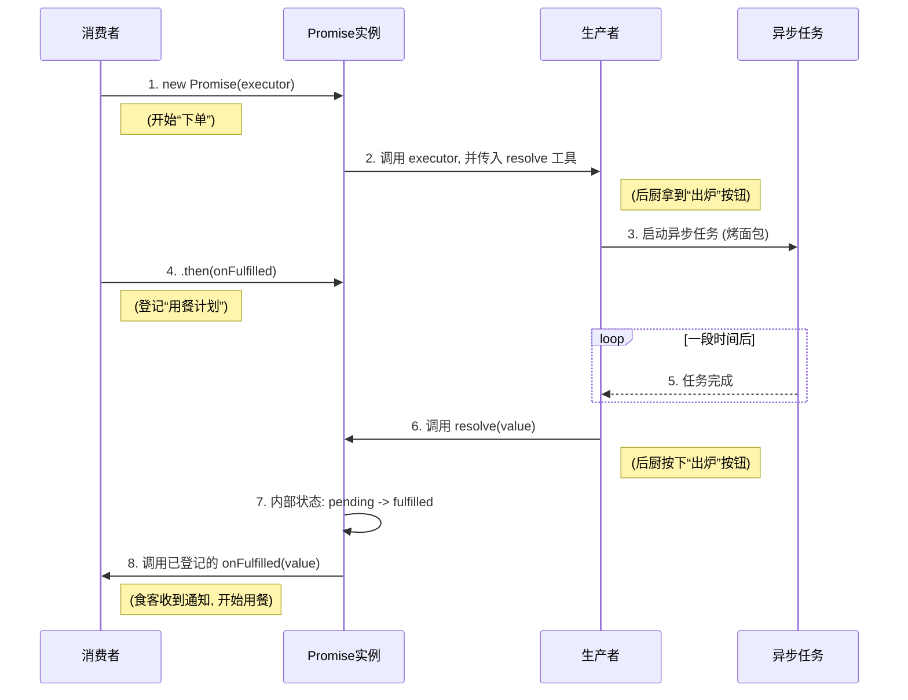

-----

### **学习笔记：Promise 解惑——揭秘 `resolve` 与 `.then` 回调的本质区别**

#### **引言：一个普遍的错误思维模型**

在学习 Promise 时，我们常常会看到这样的结构：

```javascript
const pm = new Promise((resolve, reject) => {
    // ... 异步操作 ...
    resolve(value); // 这里有一个 resolve
});

pm.then(value => { // 这里有一个接收 value 的回调
    // ...
});
```

由于 `resolve` 传递的值，最终被 `.then` 的回调接收，很多人会想当然地认为它们是同一个东西的两个部分。

**这是一个完全错误的思维模型。**

正确的理解是：`resolve` 和 `.then` 的回调是两个**角色完全不同、职责完全分离**的实体。它们是**生产者 (Producer)** 与**消费者 (Consumer)** 的关系。

-----

### “面包店”的比喻

为了清晰地区分，让我们再次使用“面包店”的比喻：

  * **Promise 实例 (`pm`)**：一家面包店。
  * **`executor` 函数**：面包店的**后厨**，负责生产。
  * **`resolve` 函数**：后厨墙上的一个**内部专用按钮**，上面写着“**出炉**”。
  * **`.then()` 方法**：面包店的**前台**，负责接待顾客。
  * **`onFulfilled` 回调**：**顾客**留下的一个“**取餐计划**”。

-----

### **角色一：`executor` 中的 `resolve` —— 内部的“生产者”**

`resolve` 函数是 Promise 机制提供给**生产者**（即 `executor` 函数）的工具。

  * **职责：改变 Promise 的内部状态**
    它的唯一工作，就是将 Promise 的状态从 `pending`（准备中）切换到 `fulfilled`（已成功），并把生产好的“面包”（`value`）放到取餐区。它是**因**，是**主动的触发者**。

  * **身份：内部控制开关**
    `resolve` 是一个由 Promise 机制自动创建并传入 `executor` 的函数。它是一个内部工具，只能在 `executor` 的作用域内被调用。你作为 Promise 的使用者，永远无法从外部调用 `pm.resolve()`。

  * **调用时机：任务完成时**
    它在你的异步操作（烤面包）成功完成的那一刻被调用。

**总结：`resolve` 是后厨师傅按下的那个“出炉”按钮。这个动作标志着生产环节的结束，并触发了状态的改变。**

-----

### **角色二：`.then()` 中的 `onFulfilled` —— 外部的“消费者”**

`onFulfilled` 回调函数是由 Promise 的**使用者**提供给**消费者**的计划。

  * **职责：消费 Promise 的成功结果**
    它的工作是在得到通知后，去取餐区拿到“面包”（`value`）并进行处理（比如吃掉）。它**不会**改变 Promise 的状态，只是在状态改变后被动地执行。它是**果**，是**被动的响应者**。

  * **身份：外部响应计划**
    `onFulfilled` 是一个由你（使用者）定义的普通函数。你通过 `.then()` 方法把它“登记”给 Promise，告诉它“事成之后，就这样做”。

  * **调用时机：状态已经改变后**
    它在 `resolve` 被调用、Promise 状态已经变为 `fulfilled` 之后，才由 Promise 机制自动调用。

**总结：`onFulfilled` 是顾客在听到“取餐通知”后，执行的那个“吃面包”的计划。**

-----

### **核心差异对比**

| 特征 | `executor` 中的 `resolve` | `.then` 中的 `onFulfilled` |
| :--- | :--- | :--- |
| **角色比喻** | 后厨的“**出炉按钮**” | 食客的“**用餐计划**” |
| **核心职责** | **改变 Promise 状态** (因) | **消费 Promise 结果** (果) |
| **定义方** | Promise 机制**内部** | Promise 的**使用者** (外部) |
| **调用方** | **`executor` 函数** (生产者) | **Promise 机制** (中介) |
| **调用时机** | 异步操作**成功完成时** | Promise 状态**已经变为 `fulfilled` 时** |

-----

### **协作流程：它们如何互动？**



**结论：**
将 `resolve` 和 `.then` 的回调混为一谈，是一个错误的思维模型。一旦你清晰地区分了这两者，你就掌握了 Promise 设计模式的精髓：将“**执行异步任务并决定其结果（生产）**”的逻辑，与“**如何消费这个结果（消费）**”的逻辑，**彻底分离开来**。这使得代码的职责更清晰，组合更灵活。