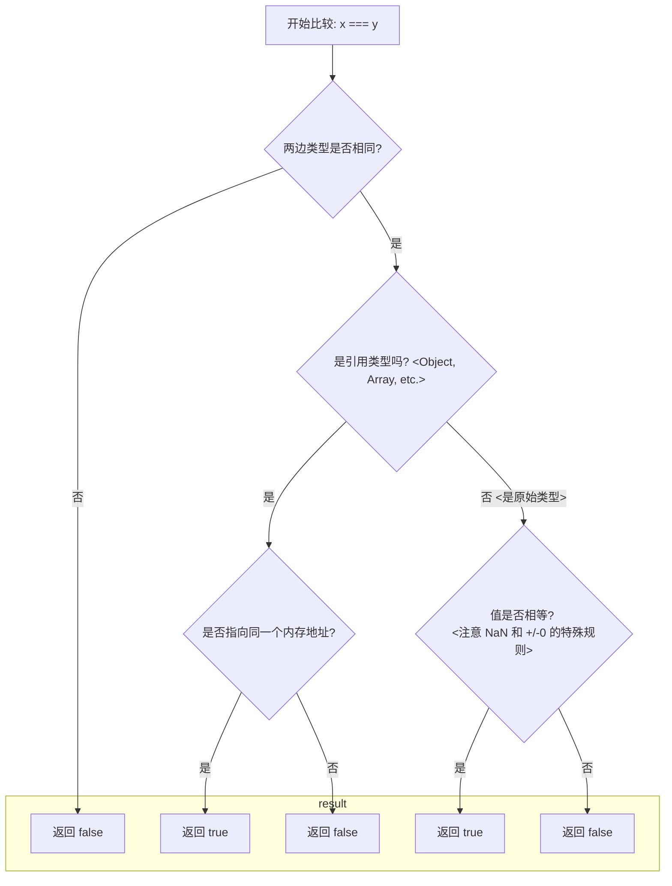

```mermaid
graph TD
    A[开始比较: x === y] --> B{两边类型是否相同?};
    B -- 否 --> C[返回 false];
    B -- 是 --> D{是引用类型吗? &ltObject, Array, etc.&gt};
    D -- 是 --> E{是否指向同一个内存地址?};
    E -- 是 --> F[返回 true];
    E -- 否 --> G[返回 false];
    D -- 否 &lt是原始类型&gt --> H{值是否相等? <br/>&lt注意 NaN 和 +/-0 的特殊规则&gt};
    H -- 是 --> I[返回 true];
    H -- 否 --> J[返回 false];

    subgraph result
        direction LR
        C; F; G; I; J;
    end
```