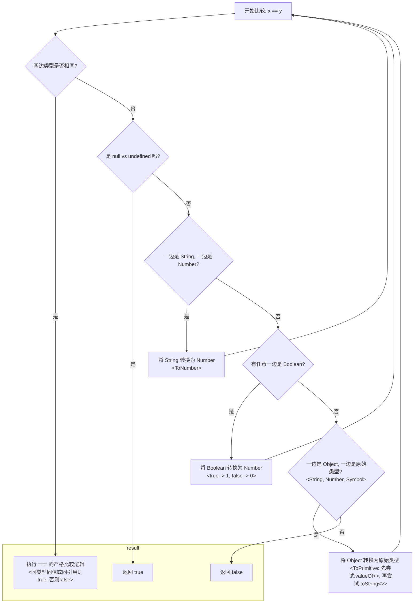

根据6（5基本，不算symbol + 1 Object）个类型做消消乐

 6 个核心类型为基础：**`Undefined`**, **`Null`**, **`Boolean`**, **`Number`**, **`String`**, **`Object`**。

总共有 `6 * 6 = 36` 种输入组合，去除顺序差异后，共有 `6 (同类型) + (6 * 5 / 2) = 21` 种独特的比较场景。现在，我们就来看 `==` 运算符的比较逻辑是如何一步步“消解”这 21 种组合的。

我们可以把 `==` 的比较逻辑想象成一个**带有优先级的处理器**，它会按顺序应用规则，一旦某个规则适用，它就会处理并（通常会）将问题转化，或者直接得出结论。

---

### 第一类：同类型比较 (6 种组合被立即确定)

这是最简单的一类，处理器看到两边类型相同，会立刻把任务转交给 `===` 处理器。

* **规则**：若 `Type(x)` 与 `Type(y)` 相同，则执行 `x === y`。
* **确定的组合 (6/21)**：
    1.  `Undefined == Undefined` -> `true`
    2.  `Null == Null` -> `true`
    3.  `Boolean == Boolean` -> `true` 或 `false`
    4.  `Number == Number` -> `true` 或 `false`
    5.  `String == String` -> `true` 或 `false`
    6.  `Object == Object` -> `true` 或 `false` (比较引用地址)

**结果**：6 种最基础的组合被立即解决，逻辑清晰。

---

### 第二类：不同类型比较 (剩下的 15 种组合)

这是 `==` 算法真正施展“魔法”的地方。处理器会按以下优先级顺序来应用转换规则。

#### **最高优先级规则：`null` vs `undefined` (确定 1 种组合)**

这是规范中的“VIP通道”，拥有最高优先权。

* **规则**：若 `x` 为 `null` 且 `y` 为 `undefined`（或反之），则结果为 `true`。
* **确定的组合 (1/15)**：
    7.  `Null == Undefined` -> `true`

**结果**：最特殊的异类型组合被直接解决。

#### **第二优先级规则：处理布尔值 (转化 4 种组合)**

处理器接下来会寻找布尔值，只要看到 `Boolean`，就会毫不犹豫地将它转换为 `Number`。

* **规则**：若有操作数为布尔值，则执行 `ToNumber(Boolean)` 将其转换为 `1` 或 `0`，然后重新比较。
* **这会“转化”以下 4 种组合，并让问题进入下一轮判断**：
    8.  **`Boolean == Number`**
        * 转化：`ToNumber(Boolean) == Number`
        * **问题降级为**：`Number == Number` (第一类问题)
    9.  **`Boolean == String`**
        * 转化：`ToNumber(Boolean) == String`
        * **问题降级为**：`Number == String` (下一条规则将处理)
    10. **`Boolean == Object`**
        * 转化：`ToNumber(Boolean) == Object`
        * **问题降级为**：`Number == Object` (更后面的规则将处理)
    11. **`Boolean == Null` / `Undefined`**
        * 转化：`ToNumber(Boolean) == Null` / `Undefined`
        * **问题降级为**：`Number (1或0) == Null` / `Undefined` (最后的规则将处理)

**结果**：布尔值的存在，会强制将 4 种复杂的比较，转化为不含布尔值的新比较。

#### **第三优先级规则：处理 数字 vs 字符串 (转化 1 种组合)**

在处理完布尔值后，处理器会寻找 `Number` 和 `String` 的组合。

* **规则**：若操作数为数字和字符串，则执行 `ToNumber(String)` 将字符串转换为数字，然后重新比较。
* **转化的组合 (1/15)**：
    12. **`Number == String`**
        * 转化：`Number == ToNumber(String)`
        * **问题降级为**：`Number == Number` (第一类问题)

**结果**：数字与字符串的比较被转化为纯数字的比较。

#### **第四优先级规则：处理对象 (转化 3 种组合)**

如果以上规则都不适用，处理器会开始寻找 `Object` 类型。

* **规则**：若操作数为对象和原始类型，则对对象执行 `ToPrimitive()` 操作（先尝试 `valueOf()`，再尝试 `toString()`），然后重新比较。
* **转化的组合 (3/15)**：
    13. **`Object == Number`**
        * 转化：`ToPrimitive(Object) == Number`
        * **问题降级为**：`String == Number` 或 `Number == Number`
    14. **`Object == String`**
        * 转化：`ToPrimitive(Object) == String`
        * **问题降级为**：`String == String` 或 `Number == String`
    15. `Object == Boolean` (这个组合在第二步已经被布尔值规则捕获并转化了)

**结果**：对象的比较被转化为其原始值的比较，问题再次降级。

#### **最后：无法匹配任何转换规则 (确定剩下的 6 种组合)**

在以上所有“积极”的转换规则都尝试过后，如果仍然没有匹配上，那么剩下的组合将直接得到 `false`。这些主要是涉及 `null` 或 `undefined` 的组合（除了它们相互比较之外）。

* **规则**：不符合以上任何一条转换规则，则返回 `false`。
* **确定的组合 (6/15)**：
    16. `Number == Null`
    17. `Number == Undefined`
    18. `String == Null`
    19. `String == Undefined`
    20. `Object == Null`
    21. `Object == Undefined`

**结果**：所有 `null` 和 `undefined` 与其他类型（布尔值除外，因其已被转化）的比较，都被确定为 `false`。

### 总结

`==` 的逻辑并不是一个扁平的列表，而是一个**分层、递归的决策过程**。它通过一系列优先级明确的转换规则，**不断地将复杂问题“降级”为更简单的问题**，直到可以进行同类型比较或命中特殊规则为止。

* **6 个** 同类型组合被 `===` 规则立即确定。
* **1 个** `null/undefined` 组合被特殊规则立即确定。
* **8 个** 涉及布尔、数字、字符串、对象的组合，被强制转换为更简单的组合，进入下一轮循环。
* **6 个** 涉及 `null/undefined` 的组合，在所有转换失败后，被确定为 `false`。

