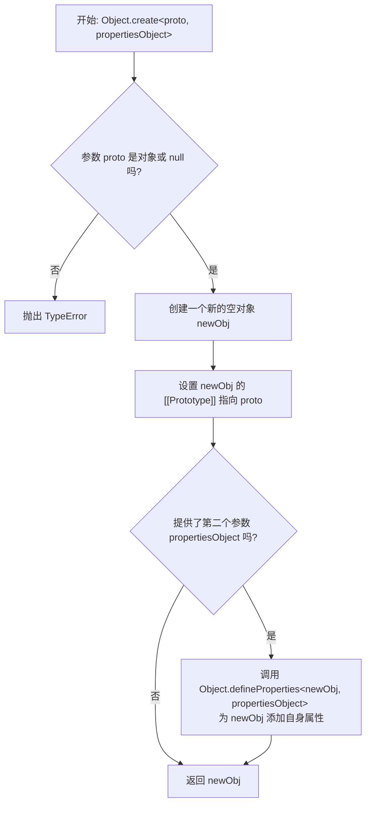

```mermaid
graph TD
    A[开始: Object.create&ltproto, propertiesObject&gt] --> B{参数 proto 是对象或 null 吗?};
    B -- 否 --> C[抛出 TypeError];
    B -- 是 --> D[创建一个新的空对象 newObj];
    D --> E["设置 newObj 的 [[Prototype]] 指向 proto"];
    E --> F{提供了第二个参数 propertiesObject 吗?};
    F -- 否 --> G[返回 newObj];
    F -- 是 --> H[调用 Object.defineProperties&ltnewObj, propertiesObject&gt <br/>为 newObj 添加自身属性];
    H --> G;
```