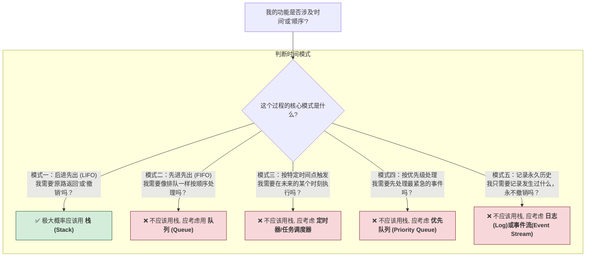
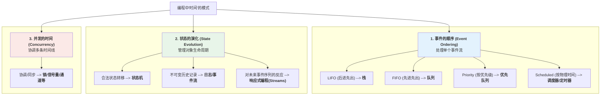

### **学习笔记：编程中“时间”的设计模式**

**日期：** 2025年7月26日

#### **一、 问题的起点：为什么既需要“调用栈”又需要“作用域链”？**

我们的讨论始于一个关于 JavaScript 引擎模拟的深刻问题：如果词法环境已经通过 `outer` 指针形成了链，为什么还需要一个独立的执行上下文“栈”？

**核心结论：** 它们解决的是两个维度完全不同的问题。

| 特性 | **调用栈 (Execution Stack)** | **作用域链 (Scope Chain)** |
| :--- | :--- | :--- |
| **核心目的** | 管理函数的**调用顺序**和执行状态 | 管理变量的**查找规则**和可见性 |
| **性质** | **动态的 (Dynamic)** - 随函数调用和返回而改变 | **静态的 (Static)** - 在函数定义时就已确定 |
| **决定于** | 程序的**运行时**行为 | 源代码的**书写位置** (词法结构) |
| **回答的问题** | "程序是如何执行到这里的？" (How) | "我能看到哪些变量？" (What) |

这个区分是理解后续所有时间模式的基础：**我们必须分清一个过程是关乎“执行流”，还是关乎“词法上下文”。**

-----

#### **二、 第一个设计直觉：与时间有关，就想到栈**

从上述问题中，我们提炼出第一个重要的设计直觉：**在编程中，关于时间的、动态的东西，大多用栈来表示。**

这个直觉的核心在于 **“后进先出”（Last-In, First-Out, LIFO）** 模式。当一个过程的生命周期天然遵循 LIFO 规则时，栈就是最完美的模型。

**经典应用场景：**

  * **函数调用**：最后调用的函数最先返回。
  * **撤销/重做 (Undo/Redo)**：总是撤销最近的一次操作。
  * **语法解析**：处理嵌套结构，如 `(a * (b + c))`，必须先处理内层。
  * **UI 导航**：点击返回按钮，总是回到上一个页面。
  * **深度优先搜索 (DFS)**：在算法中进行路径探索和回溯。

-----

#### **三、 核心方法论：一个实用的设计决策框架**

为了让上述直觉更精确、更具普适性，我们建立了一个决策框架。关键点在于：**不要只问“是否和时间有关”，而要问“它遵循哪种时间模式？”**

**决策流程图:**

这个框架是日常设计中最实用的部分，它将一个模糊的问题（关于时间）转化成了一系列清晰的选择题。

-----

#### **四、 拓展视野：更全面的“时间”模式版图**

最后，我们将视角从处理单一事件序列的“微观”层面，提升到管理对象生命周期和协调多重时间线的“宏观”层面，形成了一幅更完整的知识地图。

**“时间”模式的维度：**

1.  **事件的顺序 (Event Ordering)**：处理单个事件流，是 LIFO、FIFO 还是按优先级？
2.  **状态的演化 (State Evolution)**：对象状态如何随时间合法变迁？
3.  **并发的时间 (Concurrency)**：如何协调多条并行的“时间线”？

**更完整的模式图:**

-----

