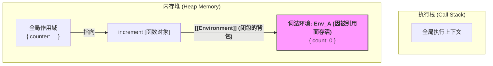

在底层，JavaScript 的闭包**并没有一个叫做“闭包”的特殊实体或独立的实现机制**。相反，它更像是一种**现象**，是 JavaScript 几个核心工作原理协同运作时必然产生的一个强大结果。

要理解闭包的实现，我们需要将我们之前讨论过的三个核心概念联系在一起：

1.  **函数是“一等公民” (First-Class Functions)**：函数可以像普通变量一样被创建、存储、作为参数传递、以及作为返回值返回。
2.  **静态的词法作用域 (Static Lexical Scoping)**：函数的作用域链（能访问哪些变量）在它被**定义**时就已经被决定和固化了，与它在哪里被调用无关。
3.  **基于可达性的垃圾回收 (Reachability-based Garbage Collection)**：一个对象（或环境）只要还能被从“根”访问到，就不会被回收。

闭包的实现，正是这三大支柱的完美结合。

-----

### 一个经典闭包的完整生命周期

我们用最经典的计数器例子，来一步步剖析引擎的底层行为。

```javascript
function createCounter() {
    let count = 0; // 步骤 2: 这个变量存在于 createCounter 的词法环境中

    // 步骤 3: increment 函数在此处被定义
    return function increment() {
        count++;
        return count;
    };
}

// 步骤 1: 调用 createCounter
const counter = createCounter(); // 步骤 4: counter 变量持有对 increment 函数的引用

// 步骤 6: 在未来的某个时刻，调用闭包
console.log(counter()); // 输出: 1
console.log(counter()); // 输出: 2
```

#### 阶段一：编译时 —— 蓝图的绘制 (词法作用域)

在代码执行之前，引擎会先进行快速的编译/解析。

  * 当解析器读到 `createCounter` 函数时，它看到了内部嵌套的 `increment` 函数。
  * **这是闭包的“播种”时刻**：解析器根据代码的嵌套结构，确定了 `increment` 的词法作用域。它在内部为 `increment` 函数对象创建了一个 `[[Environment]]` 属性，这个属性包含一个**指针**，指向它“出生地”的环境，也就是 `createCounter` 的词法环境。
  * 这个链接是**静态的、永久的**。`increment` 函数从此刻起，就永远“记住”了它的出生地。

#### 阶段二：运行时 —— `createCounter()` 的调用与返回

1.  **`createCounter()` 被调用**：

      * 一个为 `createCounter` 准备的**执行上下文**被创建并压入**执行栈**。
      * 同时，一个**词法环境**（我们称之为 `Env_A`）被创建，用来存储 `createCounter` 的局部变量。
      * `let count = 0` 执行后, `Env_A` 的内部记录为 `{ count: 0 }`。

2.  **`return function increment()`**：

      * `increment` 函数对象在此时被**实例化**。
      * 它的 `[[Environment]]` 指针（它的“背包”）被设置为指向**当前正在活动的 `Env_A`**。
      * `createCounter` 函数返回了这个 `increment` 函数对象。
      * 全局变量 `counter` 现在持有了对 `increment` 函数对象的引用。

3.  **`createCounter()` 执行完毕**：

      * `createCounter` 的执行上下文从**执行栈中弹出**。
      * 从执行栈的角度看，`createCounter` 的生命周期已经结束了。

#### 阶段三：持久化 —— 垃圾回收机制的介入

这是理解闭包实现**最关键**的一步。

  * 通常，当一个函数从执行栈中弹出后，它的词法环境（如 `Env_A`）如果没有被任何东西引用，就会被垃圾回收器（GC）当作垃圾清理掉。
  * **但是，现在情况不同了！** GC 开始进行**标记-清除 (Mark-and-Sweep)** 工作：
    1.  GC 从“根”开始查找，它找到了全局变量 `counter`。
    2.  `counter` 是可达的，所以它引用的 `increment` 函数对象也是**可达的（存活）**。
    3.  GC 接下来会检查 `increment` 函数对象本身。它发现 `increment` 对象内部有一个 `[[Environment]]` 指针，这个指针**强引用**着 `Env_A`。
    4.  因此，`Env_A` 也被认为是**可达的（存活）**！
    5.  GC 决定：**不能回收 `Env_A`**。`Env_A`（连同它内部的 `{ count: 0 }`）将继续存在于内存堆中，即使创建它的函数已经执行完毕。

#### 阶段四：闭包的调用

1.  **`counter()` 被调用**：

      * 一个为 `increment` 准备的**执行上下文**被创建并压入**执行栈**。
      * 为这次调用创建一个**新的、临时的词法环境**（我们称之为 `Env_B`）。
      * **作用域链的重建**：引擎需要设置 `Env_B` 的 `outer` 引用。它会读取 `increment` 函数对象“背包”里的 `[[Environment]]` 指针，发现它指向 `Env_A`。
      * 于是，`Env_B` 的 `outer` 指针就被设置指向那个在内存中存活下来的 `Env_A`。
      * 此时的**作用域链**是：`Env_B` -\> `Env_A` -\> `全局环境`。

2.  **执行 `count++`**：

      * 引擎在 `Env_B` 中查找 `count` -\> 未找到。
      * 引擎顺着 `outer` 指针，跳转到 `Env_A` 中查找 -\> **找到了！** 值为 `0`。
      * 引擎将 `Env_A` 中的 `count` 值修改为 `1`。

3.  **`counter()` 返回**：

      * `increment` 的执行上下文从执行栈中弹出，`Env_B` 被销毁。
      * 但 `Env_A`（现在其内部记录为 `{ count: 1 }`）因为仍然被全局变量 `counter` （通过 `increment` 函数）引用着，所以继续存活。

下一次调用 `counter()` 时，重复阶段四，`Env_A` 中的 `count` 将被修改为 `2`。

### 可视化模型

`createCounter` 执行完毕后，`counter` 被调用前的内存状态：



**总结**：
闭包的底层实现，正是**词法作用域**（在函数创建时静态绑定环境）、**函数作为一等公民**（允许函数脱离其定义环境而存在）和**垃圾回收机制**（通过可达性分析保留了被引用的环境）这三者协同工作的精妙结果。它使得函数可以“携带”着它的“出生证明”和“家庭背景”在程序中任意穿梭和执行。