-----

### **学习笔记：用状态机思维武装自己——从`debounce`实战中掌握复杂逻辑的设计方法**

#### **引言：为何感觉陌生？**

在尝试编写 `debounce` (防抖) 和 `throttle` (节流) 这类函数时，我们常常会感到一种“陌生感”和不确定性。代码似乎总是在处理各种情况，逻辑容易写乱。这种感觉的根源在于，这类函数的核心是**管理随时间变化的状态 (State)**。

解决这种混乱的“解药”，就是引入一种结构化的思维方式——**状态机 (State Machine)**。它不是一种新技术，而是一种将复杂行为分解为简单、可管理部分的设计模式。

#### **一、什么是状态机？—— 核心三要素**

状态机是一个行为蓝图，它精确地描述了一个系统能做什么。任何一个状态机，都由三个核心要素构成：

1.  **状态 (States)**：系统可以存在的几种**稳定、离散的状况**。例如，电灯的两种状态就是 `[开]` 和 `[关]`。
2.  **事件 (Events)**：能够**触发状态发生改变的外部动作**。例如，对于电灯，事件就是 `按下开关`。
3.  **转移 (Transitions)**：从一个状态迁移到另一个状态的过程，通常还伴随着一个**动作 (Action)**。转移由 `当前状态 + 发生的事件` 共同决定。例如：“当电灯处于 `[关]` 状态时，如果发生 `按下开关` 事件，则执行 `开灯` 动作，并转移到 `[开]` 状态”。

#### **二、如何构建状态机？—— 一个四步法实战 (`debounce`案例)**

让我们用 `debounce` 函数作为实例，一步步构建出它的状态机。

##### **第一步：识别所有“状态 (States)”**

  * **提问**：“我的 `debounce` 函数在任何时刻，可以处于哪些不同的‘模式’下？”
  * **分析**：它的核心是 `timer` 变量。
      * 当 `timer` 为 `null` 时，它处于 **`[空闲 (Idle)]`** 状态，可以接受新的执行计划。
      * 当 `timer` 持有 ID 时，它处于 **`[等待中 (Waiting)]`** 状态，正在等待计时结束。
  * **结论**：我们有两个状态：`[Idle]` 和 `[Waiting]`。

##### **第二步：找出所有“事件 (Events)”**

  * **提问**：“什么事情会‘推动’系统发生变化？”
  * **分析**：能改变 `debounce` 内部状态的只有两件事。
    1.  **`call`**：用户调用了被包装的函数。
    2.  **`timer_fires`**：`setTimeout` 定时器到点了。
  * **结论**：我们有两个事件：`call` 和 `timer_fires`。

##### **第三步：定义“转移 (Transitions)” 和 “动作 (Actions)”**

  * **提问**：“如果系统处于某个状态，并且某个事件发生了，会怎么样？”
  * **分析**：
      * **当前状态: `[Idle]`** + **事件: `call`**
          * **动作**: 启动一个新定时器。
          * **转移到**: `[Waiting]` 状态。
      * **当前状态: `[Waiting]`** + **事件: `call`**
          * **动作**: **清除旧定时器，启动新定时器** (防抖的核心)。
          * **转移到**: `[Waiting]` 状态 (保持不变，但重置了计划)。
      * **当前状态: `[Waiting]`** + **事件: `timer_fires`**
          * **动作**: **执行核心函数 `fn()`**，并清空 `timer` 变量。
          * **转移到**: `[Idle]` 状态。

##### **第四步：确定“初始状态”**

  * **提问**：“系统刚启动时是什么状态？”
  * **结论**：`debounce` 函数刚创建时，总是处于 **`[Idle]`** (空闲) 状态。

#### **三、可视化状态机：用 Mermaid 绘制蓝图**

现在，我们可以将上述分析的结果用图表清晰地表达出来。Mermaid 是一个极佳的工具。

```mermaid
stateDiagram-v2
    direction LR

    [*] --> Idle : 初始化

    note right of Idle
        <b>空闲状态</b><br/>
        内部 timer 为 null。<br/>
        准备好接受下一次调用。
    end note

    Idle --> Waiting : call / 启动新定时器
    
    note right of Waiting
        <b>等待状态</b><br/>
        内部 timer 持有 ID。<br/>
        正在等待静默期结束。
    end note

    Waiting --> Waiting : call / 重置定时器
    Waiting --> Idle : timer_fires / 执行 fn(), 状态重置
```



  * **解读**: 这张图就是我们 `debounce` 函数的行为蓝图。`StateA --> StateB: Event / Action` 的语法格式，清晰地描述了每一次状态转移的“前因后果”。

#### **四、从蓝图到代码：状态机的编程实现**

有了清晰的蓝图，编写代码就变成了“按图索骥”，思路会非常清晰。

```javascript
function debounce(fn, delay) {
    let timer = null; // 这个变量就代表了我们的“状态”

    return function(...args) {
        const context = this;
        
        // 对应事件：call
        // ==========================================================

        // 检查当前状态是否是 "Waiting" (timer 是否有值)
        if (timer) {
            // 这是从 Waiting -> Waiting 的转移
            // 动作：重置定时器
            clearTimeout(timer);
        }
        
        // 这是从 Idle -> Waiting 或 Waiting -> Waiting 的转移
        // 动作：启动(新)定时器
        timer = setTimeout(() => {
            // 对应事件：timer_fires
            // ======================================================
            // 动作1：执行核心函数
            fn.apply(context, args);
            // 动作2：状态重置 (转移到 Idle 状态)
            timer = null; 
        }, delay);
    };
}
```

  * `timer` 变量的存在与否，就代表了 `Waiting` 和 `Idle` 两个状态。
  * 返回的函数体，就是对 `call` 事件的处理逻辑。
  * `setTimeout` 的回调函数，就是对 `timer_fires` 事件的处理逻辑。

#### **结论与建议**

将一个复杂的异步行为建模成一个状态机，是一种化繁为简的强大技巧。

  * **核心流程**：**识别状态 -\> 找出事件 -\> 定义转移 -\> 绘制蓝图 -\> 编写代码**。
  * **优点**：它将混乱的、凭感觉的编码过程，转变为一个清晰、结构化的设计过程，能有效减少 bug，并让代码逻辑一目了然。
  
