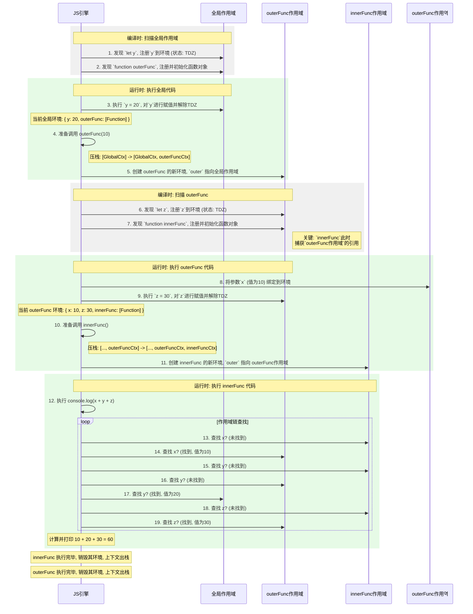

 JavaScript 引擎与传统编译器（如 C++ 或 Java 的编译器）在工作模式上的一个根本区别。

传统的**预编译 (Ahead-of-Time, AOT)** 语言，就像是**建造一栋大楼**：
1.  **编译阶段**：设计师和建筑师需要**完整地**画出所有楼层的设计图纸，进行结构分析、材料计算等。这是一个漫长且彻底的准备过程。在所有图纸都完成并审核通过之前，一砖一瓦都不会动工。
2.  **运行阶段**：图纸完成后，施工队拿走图纸开始施工。这个阶段他们只管照着图纸盖，不再关心设计层面的问题。

而 JavaScript 的工作模式，正如你所说，更像是 **“编译一层，运行一层”**，我们可以称之为**即时编译 (Just-in-Time, JIT)** 的工作流。

这更像是**用 GPS 导航开车**：

1.  **第一层（全局作用域）**：
    * **编译**：你输入目的地，GPS（JS引擎）**快速规划出起始的几条路**（扫描全局作用域，处理 `let y` 和 `function outerFunc` 的声明，进行提升）。它并不会一次性计算出全程每一秒的细节。
    * **运行**：你发动汽车，开始**按照规划好的前几条路行驶**（执行全局代码，如 `y = 20`）。

2.  **第二层（`outerFunc` 作用域）**：
    * **触发**：当你开车到达一个关键路口，准备拐入一条新的主路时（调用 `outerFunc(10)`）。
    * **编译**：GPS **在此时才开始详细规划**这条新的主路以及它的分支路况（扫描 `outerFunc` 的内部，处理 `let z` 和 `innerFunc` 的声明）。
    * **运行**：你拐上这条主路，**开始在这条新规划的路线上行驶**（执行 `outerFunc` 的内部代码，如 `z = 30`）。

3.  **第三层（`innerFunc` 作用域）**：
    * **触发**：在主路上，你又需要拐进一条小巷（调用 `innerFunc()`）。
    * **编译->运行**：GPS 再次重复上述过程，为这条小巷即时规划并导航。

### 为什么 JavaScript 要这样设计？

1.  **动态性与灵活性**：JavaScript 是一门非常动态的语言。你可以在运行时给对象添加新方法、使用 `eval()` 执行字符串代码等。这种“边走边看”的模式能更好地适应语言的动态特性。如果一开始就全部编译成固定的机器码，很多动态特性将难以实现。

2.  **Web 环境的需要**：在浏览器中，`<script>` 标签可以分段加载和执行。引擎需要有能力处理一段代码，运行它，然后再接收下一段代码。这种“编译一层，运行一层”的模式非常适合这种渐进式加载的环境。

3.  **性能优化 (JIT)**：这是现代引擎的核心优势。引擎不需要在开始时花费大量时间进行重量级的全量编译。它可以先快速地解释执行，同时在后台监控哪些代码（比如一个循环内的函数）被频繁调用。一旦发现“热点代码”，JIT 编译器就会在**运行时**介入，将这部分代码编译成高度优化的机器码，从而实现接近原生代码的运行速度。这兼顾了启动速度和运行效率。

### 总结

JavaScript 的执行并非一个泾渭分明的“先完整编译，再整体运行”的过程。它是一个**动态的、分层的、交错的循环**：

**对一个作用域进行快速编译（处理声明） -> 立即运行该作用域的代码（处理赋值和调用） -> 遇到新的函数调用 -> 对新的函数作用域重复这个循环。**

