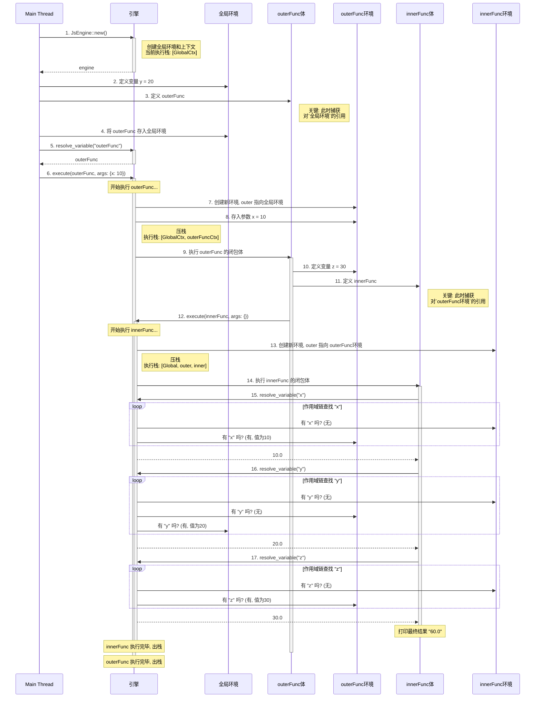

```mermaid
sequenceDiagram
    participant main as Main Thread
    participant JsEngine as 引擎
    participant GlobalEnv as 全局环境
    participant outerFunc as outerFunc体
    participant outerFuncEnv as outerFunc环境
    participant innerFunc as innerFunc体
    participant innerFuncEnv as innerFunc环境

    main->>JsEngine: 1. JsEngine::new()
    activate JsEngine
    note right of JsEngine: 创建全局环境和上下文<br/>当前执行栈: [GlobalCtx]
    JsEngine-->>main: engine
    deactivate JsEngine

    main->>GlobalEnv: 2. 定义变量 y = 20
    main->>outerFunc: 3. 定义 outerFunc
    note right of outerFunc: 关键: 此时捕获<br/>对`全局环境`的引用
    main->>GlobalEnv: 4. 将 outerFunc 存入全局环境

    main->>JsEngine: 5. resolve_variable("outerFunc")
    activate JsEngine
    JsEngine-->>main: outerFunc
    deactivate JsEngine

    main->>JsEngine: 6. execute(outerFunc, args: {x: 10})
    activate JsEngine
    note over JsEngine: 开始执行 outerFunc...
    JsEngine->>outerFuncEnv: 7. 创建新环境, outer 指向全局环境
    JsEngine->>outerFuncEnv: 8. 存入参数 x = 10
    note right of JsEngine: 压栈<br/>执行栈: [GlobalCtx, outerFuncCtx]
    
    JsEngine->>outerFunc: 9. 执行 outerFunc 的闭包体
    activate outerFunc
    outerFunc->>outerFuncEnv: 10. 定义变量 z = 30
    outerFunc->>innerFunc: 11. 定义 innerFunc
    note right of innerFunc: 关键: 此时捕获<br/>对`outerFunc环境`的引用
    
    outerFunc->>JsEngine: 12. execute(innerFunc, args: {})
    activate JsEngine
    note over JsEngine: 开始执行 innerFunc...
    JsEngine->>innerFuncEnv: 13. 创建新环境, outer 指向 outerFunc环境
    note right of JsEngine: 压栈<br/>执行栈: [Global, outer, inner]
    
    JsEngine->>innerFunc: 14. 执行 innerFunc 的闭包体
    activate innerFunc
    
    innerFunc->>JsEngine: 15. resolve_variable("x")
    loop 作用域链查找 "x"
        JsEngine->>innerFuncEnv: 有 "x" 吗? (无)
        JsEngine->>outerFuncEnv: 有 "x" 吗? (有, 值为10)
    end
    JsEngine-->>innerFunc: 10.0

    innerFunc->>JsEngine: 16. resolve_variable("y")
    loop 作用域链查找 "y"
        JsEngine->>innerFuncEnv: 有 "y" 吗? (无)
        JsEngine->>outerFuncEnv: 有 "y" 吗? (无)
        JsEngine->>GlobalEnv: 有 "y" 吗? (有, 值为20)
    end
    JsEngine-->>innerFunc: 20.0

    innerFunc->>JsEngine: 17. resolve_variable("z")
    loop 作用域链查找 "z"
        JsEngine->>innerFuncEnv: 有 "z" 吗? (无)
        JsEngine->>outerFuncEnv: 有 "z" 吗? (有, 值为30)
    end
    JsEngine-->>innerFunc: 30.0

    note over innerFunc: 打印最终结果 "60.0"
    
    deactivate innerFunc
    note over JsEngine: innerFunc 执行完毕, 出栈
    deactivate JsEngine
    
    deactivate outerFunc
    note over JsEngine: outerFunc 执行完毕, 出栈
    deactivate JsEngine
```