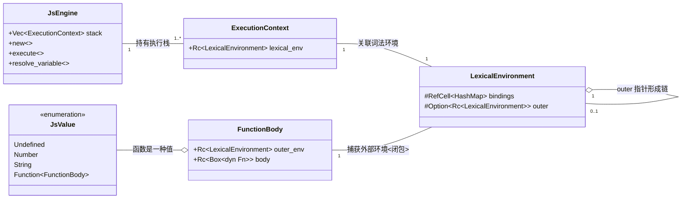

```mermaid
classDiagram
    direction LR
    class JsEngine {
        +Vec~ExecutionContext~ stack
        +new&lt&gt
        +execute&lt&gt
        +resolve_variable&lt&gt
    }
    class ExecutionContext {
        +Rc~LexicalEnvironment~ lexical_env
    }
    class LexicalEnvironment {
        #RefCell~HashMap~ bindings
        #Option~Rc~LexicalEnvironment~~ outer
    }
    class JsValue {
        <<enumeration>>
        Undefined
        Number
        String
        Function&ltFunctionBody&gt
    }
    class FunctionBody {
      +Rc~LexicalEnvironment~ outer_env
      +Rc~Box~dyn Fn~~ body
    }

    JsEngine "1" -- "1..*" ExecutionContext : 持有执行栈
    ExecutionContext "1" -- "1" LexicalEnvironment : 关联词法环境
    LexicalEnvironment "1" o-- "0..1" LexicalEnvironment : outer 指针形成链
    FunctionBody "1" -- "1" LexicalEnvironment : 捕获外部环境&lt闭包&gt
    JsValue --o FunctionBody : 函数是一种值
```