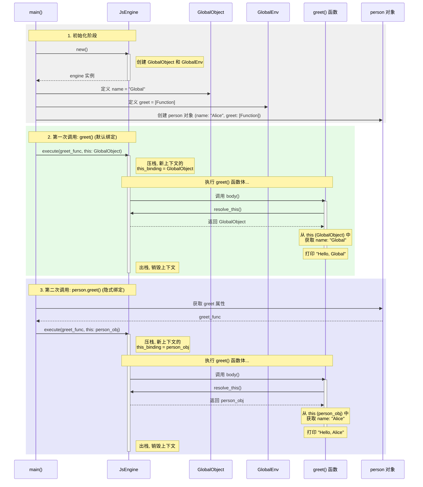

```mermaid
sequenceDiagram
    participant main as main()
    participant JsEngine
    participant GlobalObject
    participant GlobalEnv
    participant greet_func as greet() 函数
    participant person_obj as person 对象

    rect rgb(240, 240, 240)
        note over main, JsEngine: 1. 初始化阶段
        main->>JsEngine: new()
        activate JsEngine
        note right of JsEngine: 创建 GlobalObject 和 GlobalEnv
        JsEngine-->>main: engine 实例
        deactivate JsEngine

        main->>GlobalObject: 定义 name = "Global"
        main->>GlobalEnv: 定义 greet = [Function]
        main->>person_obj: 创建 person 对象 (name: "Alice", greet: [Function])
    end

    rect rgb(230, 250, 230)
        note over main, JsEngine: 2. 第一次调用: greet() (默认绑定)
        main->>JsEngine: execute(greet_func, this: GlobalObject)
        activate JsEngine
        note right of JsEngine: 压栈, 新上下文的<br>this_binding = GlobalObject
        
        note over JsEngine, greet_func: 执行 greet() 函数体...
        JsEngine->>greet_func: 调用 body()
        activate greet_func
        
        greet_func->>JsEngine: resolve_this()
        JsEngine-->>greet_func: 返回 GlobalObject
        
        note over greet_func: 从 this (GlobalObject) 中<br>获取 name: "Global"
        note over greet_func: 打印 "Hello, Global"
        
        deactivate greet_func
        note right of JsEngine: 出栈, 销毁上下文
        deactivate JsEngine
    end

    rect rgb(230, 230, 250)
        note over main, JsEngine: 3. 第二次调用: person.greet() (隐式绑定)
        main->>person_obj: 获取 greet 属性
        person_obj-->>main: greet_func

        main->>JsEngine: execute(greet_func, this: person_obj)
        activate JsEngine
        note right of JsEngine: 压栈, 新上下文的<br>this_binding = person_obj
        
        note over JsEngine, greet_func: 执行 greet() 函数体...
        JsEngine->>greet_func: 调用 body()
        activate greet_func
        
        greet_func->>JsEngine: resolve_this()
        JsEngine-->>greet_func: 返回 person_obj
        
        note over greet_func: 从 this (person_obj) 中<br>获取 name: "Alice"
        note over greet_func: 打印 "Hello, Alice"

        deactivate greet_func
        note right of JsEngine: 出栈, 销毁上下文
        deactivate JsEngine
    end
```